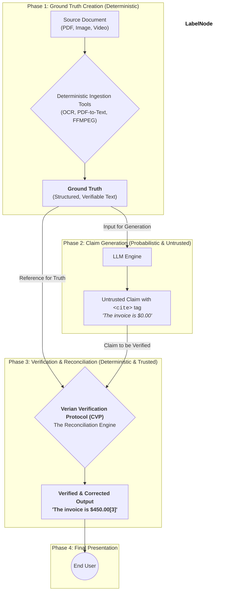

   
  <h1 align="center">Verian</h1>
  

    The Standard for Verifiable AI
  

  

    
    
    
    
  

---

## The Crisis of Trust in AI

Generative AI holds immense promise, but its utility is critically undermined by a single, pervasive flaw: **hallucination**. An AI that confidently presents unverified or fabricated information is not just unhelpful; it's a liability. As AI becomes more integrated into high-stakes domains, an unverified answer is an unacceptable risk that erodes trust and hinders adoption.

## The Solution: The Verian Standard

**Verian** is an open standard and verification protocol designed to ground generative AI in objective reality. Instead of treating an AI's output as an opaque black box, Verian provides a framework for making AI claims **transparent, auditable, and deterministically verifiable** against source documents.

### The Three Core Concepts of Verification

The Verian Standard is built on a foundation of three core concepts, applied in sequence to any AI-generated claim.

  

    <h3>1. Existence Verification</h3>
    
Does the source for this claim exist in the provided content? This first, fundamental check uses deterministic tools to combat blatant hallucinations and provide <strong>Verifiable Certainty</strong>.

  

  

    <h3>2. Contextual Integrity</h3>
    
Is the claim presented in good faith? A claim can be factually present but contextually wrong. This concept analyzes context to combat subtle hallucinations and ensure <strong>Principled Context</strong>.

  

  

    <h3>3. Adversarial Resilience</h3>
    
Can the claim be interpreted in bad faith? This final check addresses ambiguity that could be exploited. The protocol flags and resolves these issues for user transparency and robustness.

  

---

## How It Works: Visualizing Trust

An AI model generates text with a `<cite>` tag. The **Verian Verification Protocol (CVP)** then independently validates, corrects, and renders the final, truthful statement with a citation marker that transparently indicates the verification journey.

#### Rendered User Experience:

> According to the file, the patient was admitted on **December 1, 2000[1*]**. The patient, now **aged 50[2*]**, originally presented with acute pharyngitis. The final invoice was **$450.00[3]**.

  
<strong class="cite-verified">[3] Verified.</strong> The claim was a direct, contextually-correct match with the source.

  
<strong class="cite-corrected">[2*] Corrected.</strong> The CVP found the source but updated the text for contextual accuracy (e.g., calculated a current age).

  
<strong class="cite-resolved">[1*] Ambiguity Resolved.</strong> The source was ambiguous (e.g., date format), and the CVP resolved it based on established rules.

---

## The Verian Trust Graph

The power of Verian lies in its strict architectural separation between the **probabilistic act of generation** and the **deterministic act of verification**. The LLM's output is never trusted; it is a proposal that must be rigorously validated.

The user only ever interacts with the trusted, deterministic output of the Verian Verification Protocol.

---

## Join the Verian SIG: Shape the Future of Trusted AI

To ensure the Verian Standard is a universal solution, it will be governed by **Verian SIG, Inc.**, an independent corporation created and directed by its members. Our mission is to foster an ecosystem where **Verian Verified** output is the universal expectation for reliable AI.

We invite organizations to join us at one of three membership levels.

| Level | Annual Fee | Key Benefits | Ideal For |
| :--- | :---: | :--- | :--- |
| **Promoter** | Contact Us | • Seat on the Board of Directors • Direct the standard's strategy and roadmap • Chair Technical Working Groups (TWGs) • Ultimate influence over specification and IP | Industry leaders committed to defining the foundational principles of verifiable AI. |
| **Contributor**| TBD | • Participate and vote in TWGs • Early access to specification drafts • Influence technical development • Use "Verian Certified" logo on qualified products (once program launches) | Organizations actively building solutions to produce **Verian Verified** output. |
| **Adopter** | Free | • License to use the final Verian specification • Access official documentation and tools • Use "Verian Certified" logo on qualified products (once program launches) | Any organization wanting to build solutions that generate **Verian Verified** claims. |

  <h3>Become a Founding Promoter Member</h3>
  
This is a ground-floor opportunity to lead the movement for trustworthy AI. We are currently recruiting a select group of Founding Promoter Members to form the initial Board of Directors. If your organization is interested in this unique leadership opportunity, please contact our formation committee.

  <a href="mailto:contact@verian.org" class="button">Express Interest</a>

---

## Get Involved

This is your opportunity to shape the future of trusted AI from the ground up.

  

    <h3>Read the Specification</h3>
    
Dive into the technical details, core concepts, and the protocol architecture. The spec is the single source of truth for the Verian standard.

    <a href="https://github.com/Verian-Standard/spec" class="button">View Spec on GitHub</a>
  

  

    <h3>Follow Our Progress</h3>
    
Watch and star the repository to be notified of major updates, new releases, and opportunities for public comment as we move toward a v1.0 launch.

    <a href="https://github.com/Verian-Standard/spec" class="button">Watch on GitHub</a>
  

  
The Verian Standard specifications and documentation are licensed under the <a href="https://github.com/Verian-Standard/spec/blob/main/LICENSE">Apache 2.0 License</a>.

  
Governance by Verian SIG, Inc., a member-led corporation.

